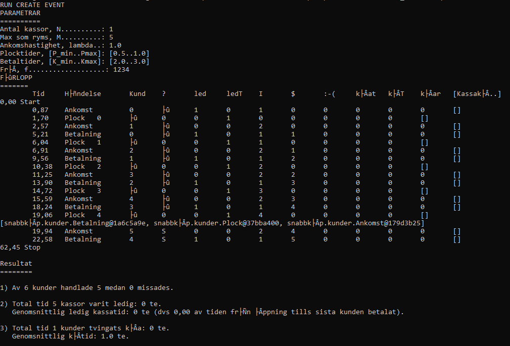

# Supermarket-Simulator Current State
### Finally the [`Betalning.java`](https://github.com/botanguzel/Supermarket-Simulator/blob/main/src/snabbk%C3%B6p/kunder/Betalning.java) works correct.

Screenshot is from cmd, which is why some characters are not shown correctly.

# Current Problem

### The `Stop` Event is instantiated with <u>wrong</u>  time, however it still works but as the image shows there is huge difference in time between the last event and the `Stop` event.
### `SnabbköpView.Resultat` includes the line `eQ.clear()`, as currently there is no other way of knowing when does the last `Betalning` event of the last customer is finished to remove the rest of the events and stop the simulation.

