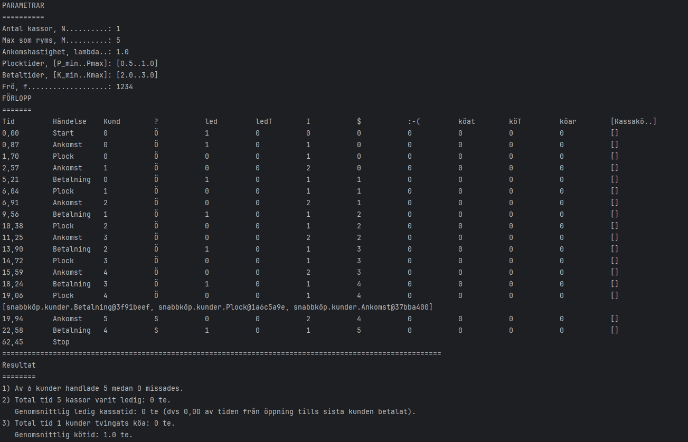

# Supermarket-Simulator Current State
### Finally the [`Betalning.java`](https://github.com/botanguzel/Supermarket-Simulator/blob/main/src/snabbk%C3%B6p/kunder/Betalning.java) works correct.
# Planned updates

Currently new Ankomst event is being instantiated inside the Ankomst event, it needs to be done outside to prevent certain order (Ankomst, Plock, (New)Ankomst, Betalning...).
Moving it to KörHändelser function and randomizing the new events time will probably fix this issue.

# Current Problems
### Somehow all the customers manages to pay without standing in line, even if the available cash register is set to 1 at the start. Most likely the wrong instantiation of new Ankomst even causes this problem.
### The Ankomst even never runs the lines 23 and 24, so missed customers stays 0 always.
### The `Stop` Event is instantiated with <u>wrong</u>  time, however it still works but as the image shows there is huge difference in time between the last event and the `Stop` event.
### `SnabbköpView.Resultat` includes the line `eQ.clear()`, as currently there is no other way of knowing when does the last `Betalning` event of the last customer is finished to remove the rest of the events and stop the simulation.

Latest output

