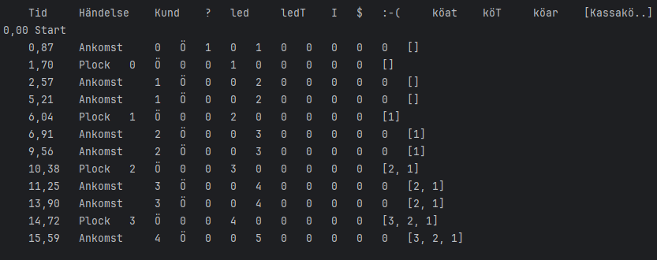

# Supermarket-Simulator
[`Betalning.java`](https://github.com/botanguzel/Supermarket-Simulator/blob/main/src/snabbk%C3%B6p/kunder/Betalning.java) works almost now, it runs with the next customers ID. Once the `betalning` event is instantiated if there is no available cash registers, the event stored in the `EventQueue`. However it stays there even if a new cash register becomes available.
